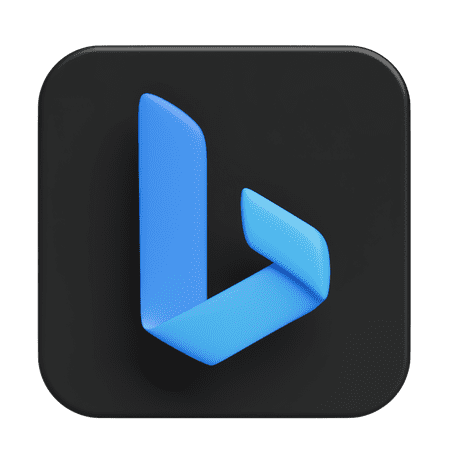

<div align="center">
<p>
  
</p>
 
# BingR-Bot 

**A focused browser-automation workspace for Microsoft Rewards experiments.**

<p>
  
  
  
  
  
</p>

<p>
  <a href="#requirements">Requirements</a> ·
  <a href="#configuration">Configuration</a> ·
  <a href="#background-execution">Background execution</a> ·
  <a href="#keyword-api">Keyword API</a>
</p>

</div>


> **Project status:** The Python bot is functional. The Go keyword API and Docker workflow are still in development/paused.

## Overview

BingR-Bot is a personal automation project for exploring browser automation, persistent Microsoft Edge profiles, and desktop/mobile search flows. The main bot is written in Python and uses Playwright with a dedicated browser profile so its state remains separate from a normal Edge session.

## Toolchain

The version tags above describe the versions currently declared or used by the repository:

| Tool | Version or channel | Role |
| --- | --- | --- |
| Python | `>=3.14` | Main bot runtime |
| Playwright | `1.62.0` (lockfile) | Browser automation |
| uv | Project manager | Dependency installation and execution |
| Microsoft Edge | `stable` / `msedge` | Browser target |
| Edge WebDriver | Matched dynamically to Edge | Driver support for the container workflow |
| Docker | Python `3.12.3-slim` base image | Optional container runtime |
| Go | Not pinned yet | Future keyword microservice |
| systemd | User service and timer | Optional Linux scheduling |

> **Compatibility note:** `pyproject.toml` requires Python 3.14 or newer, while `api/Dockerfile` currently starts from Python 3.12.3. Use the local `uv` workflow for the supported main runtime; align the Docker base image before relying on the container for the bot.


# Features

- Desktop and mobile execution modes.
- Headless execution by default.
- automatic claiming points
- Persistent Edge profile support for authenticated sessions.
- Configurable launch and navigation timeouts.
- Optional daily scheduling through a systemd user timer.
- Early Docker integration under `api/`.


# Repository layout

```text
.
├── rewards_bot.py          # Main Python automation script
├── pyproject.toml          # Project metadata and dependencies
├── uv.lock                 # Locked Python dependency versions
├── api/                    # Container and future Go API work
├── Driver_Notes/           # Microsoft Edge WebDriver notes and licenses
└── systemd/                # Example user service and timer files
```

# Requirements

- Python `3.14+` for the supported local workflow.
- [uv](https://docs.astral.sh/uv/).
- Microsoft Edge installed locally.
- Playwright browser dependencies.


## Installation

### Installation


```bash
uv sync
uv run playwright install
```


## Run the Bot

The default mode is headless:

```bash
uv run rewards_bot.py
```

To watch the browser or complete an interactive login:

```bash
HEADLESS=false uv run rewards_bot.py
```

# Configuration

Set environment variables inline or in a local `.env` file:

| Variable | Default | Description |
| --- | --- | --- |
| `EDGE_USER_DATA_DIR` | `.edge-playwright-profile` | Dedicated Edge profile directory |
| `EDGE_CHANNEL` | `msedge` | Playwright browser channel |
| `HEADLESS` | `true` | Run with or without a visible browser |
| `PLAYWRIGHT_LAUNCH_TIMEOUT_MS` | `30000` | Browser launch timeout |
| `PLAYWRIGHT_NAVIGATION_TIMEOUT_MS` | `30000` | Page navigation timeout |

Example:

```bash
EDGE_USER_DATA_DIR=/path/to/profile \
HEADLESS=false \
uv run rewards_bot.py
```

# Browser profile

The bot uses `.edge-playwright-profile/` by default. This directory can contain cookies, session data, cache, and other local browser state. Keep it private and do not commit it.

# Background execution

## Linux with systemd

The repository includes templates in `systemd/`. Copy the service and timer files into your user systemd directory, update `WorkingDirectory`, and enable the timer:

```bash
mkdir -p ~/.config/systemd/user
cp systemd/rewards-bot.service.example ~/.config/systemd/user/rewards-bot.service
cp systemd/rewards-bot.timer.example ~/.config/systemd/user/rewards-bot.timer

# Edit WorkingDirectory in the service file first.
systemctl --user daemon-reload
systemctl --user enable --now rewards-bot.timer
```

## Windows and macOS

Run the bot directly as described above, or use Task Scheduler on Windows and launchd/cron on macOS.

## Keyword API

The `api/` directory is an experimental foundation for a Go microservice that will collect keywords from public sources, beginning with Wikimedia, and expose them to the Python bot.

Planned endpoint:

```http
GET /keywords?limit=31
```

Planned response:

```json
{
  "keywords": [
    "python",
    "linux",
    "microsoft edge"
  ]
}
```

## Docker

The container workflow is still in progress. Its current image uses `python:3.12.3-slim`, installs Microsoft Edge Stable, and downloads the matching Edge WebDriver at build time. Review the Python compatibility note in [Toolchain](#toolchain) before using it.

```bash
cd api
docker compose up --build
```

## Git hygiene

Do not commit generated files, credentials, browser profiles, local evidence, or logs. Typical ignored paths include:

```gitignore
.venv/
__pycache__/
.env
.edge-playwright-profile/
edge_profile/
edge_profile_root/
evidencias/
*.png
*.log
```

## License and driver notes

Microsoft Edge WebDriver notes and bundled license material are kept under `Driver_Notes/`. Review the applicable Microsoft terms before redistributing or deploying the project.
